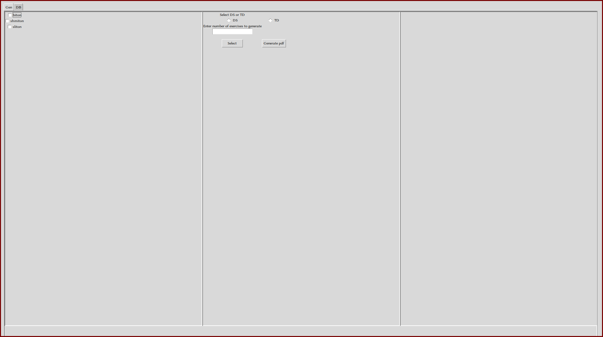
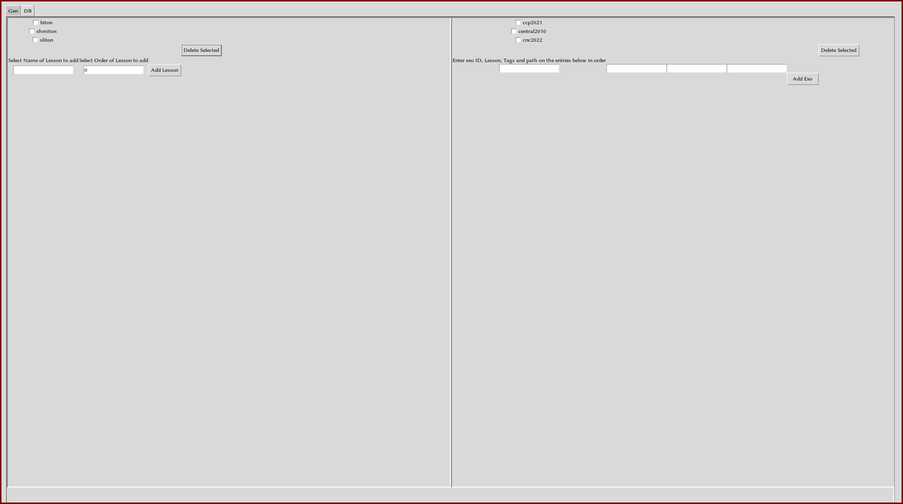

# DSGen
DSGen, a simple exam generator (DS as in devoir surveillé which basically means exam in french)


## Features :
- ### Exam Generation :
    after selecting lessons to be included in the exam, the user can choose whether they want the document outputted to be an exam (DS) or an exercise sheet (TD) (both base tex documents for these two forms should be written by user and put in the "examples/" directory. I provided an example DS tex file but it can be changed or modified to ones liking) and then input the amount of exercises the end document should have and click on select, this goes into the database and selects $n$ number of exercises related to lessons selected on the left, and outputs said exercises on the right. the output tex file is generated when the button generate pdf is clicked.
- ### Lesson and Exercise management
    this page allows you to input or delete any number of lessons or exercises the user wants to.
    > - exercice ID : a name the user can give their exercise
    > - exercice Lesson : the main lesson in the exercise
    > - exercice tags : less important lessons that are also in the exercise
    > - exercise path : the path to the exercise relative to this current directory

**please note that any change done to the lessons or exercises will only show up when DSGen is closed and reopened.**

## Installation :
- clone the repo :
```bash
git clone <git-url>
cd DSGen
```
- Install python and dependencies that are in "requirements.txt" with pip

- Run
```bash
python main.py
```